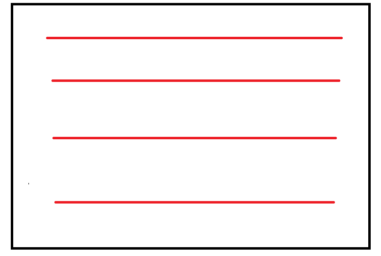

# 弹幕防碰撞方案



假设红线为当前弹幕的轨道,

轨道数据格式如下

```json
[
    {
        id:0,
        top:20,
        canpush:true,
        lastDanmu: danmuArr[1]
    },
     {
        id:1,
        top:40,
        canpush:true,
        lastDanmu: danmuArr[2]
    },
     {
        id:2,
        top:60,
        canpush:true,
        lastDanmu: danmuArr[3]
    },
     {
        id:3,
        top:80,
        canpush:true,
        lastDanmu: danmuArr[4]
    }
]
```

如果id为0的轨道插入了一条弹幕, 那么0号轨道的canpush变为false

接下来从上到下判断轨道的canpush如果为true 则插入

如果全部轨道都为false

存在一个全局变量 coverId记录当前被覆盖的轨道的id

从上到下依次覆盖, 如果判断出来canpush为true coverId归零

> coverId 不可以那么简单的实现, 判断一下  lastDanmu[i].left -  lastDanmu[i].width 最小的插入 这样的话也就不存在coverId了

如何计算canpush:

```js
canpush: lastDanmu[i].left -  lastDanmu[i].width > 0
```

插入后更改lastDanmu

